#  Nat服务器如何建站

 > nat服务器使用80和443端口建站需要和虚拟主机搭配使用，网络拓扑图如下：
 
 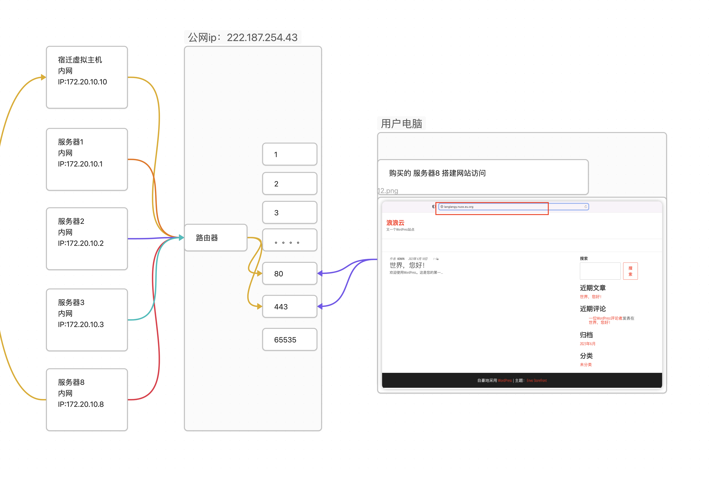
 

# 搭建Wordpress博客系统实例演示

# 购买NAT建站的专用虚拟主机
> 本次演示的是香港的虚拟主机，
![[8.png]] 
# 域名和虚拟主机ip地址绑定
> 把自己的域名和虚拟主机的ip地址进行绑定

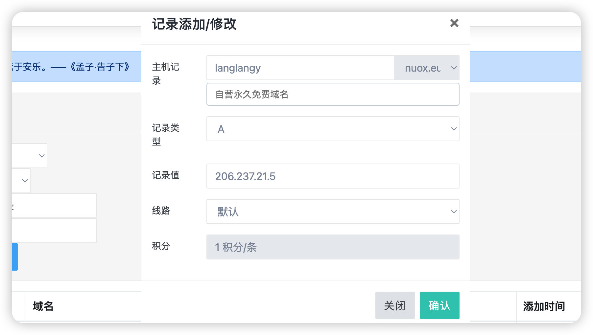
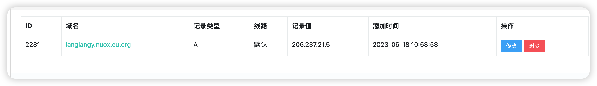
通过ping自己的域名发现绑定成功
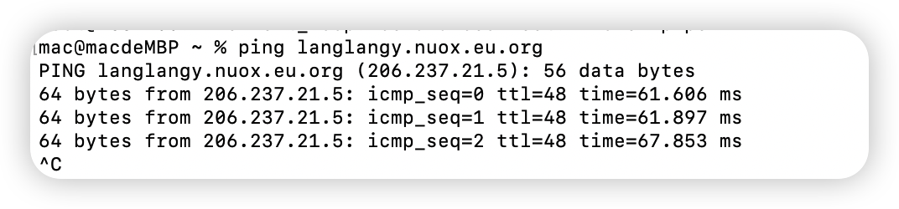
# 添加自己的域名到虚拟主机
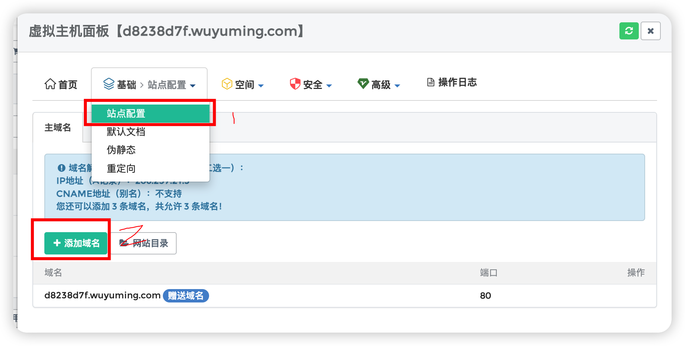
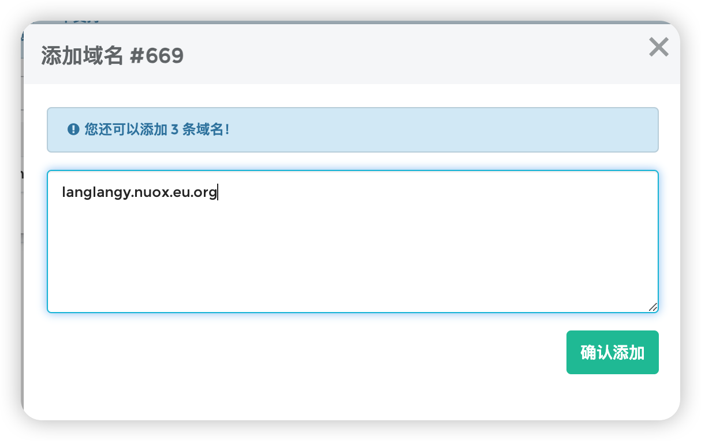
# 通过宝塔绑定两个域名，一键Wordpress部署

> **第一个域名的你的nat服务器ip**
> 第二个域名是你自己的域名
> 这里一定要填对

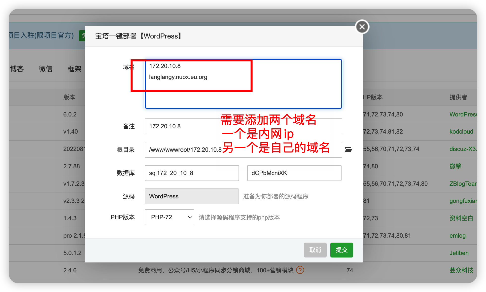
> nat服务器的ip在nat服务器控制面板里的网络里面可以找到
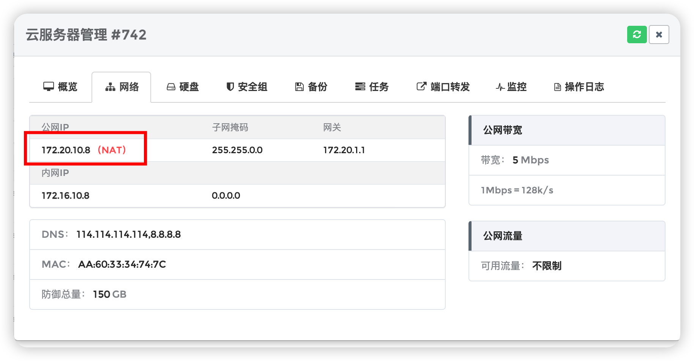

# 虚拟主机添加反向代理
> 里面的目标url是nat服务器的ip
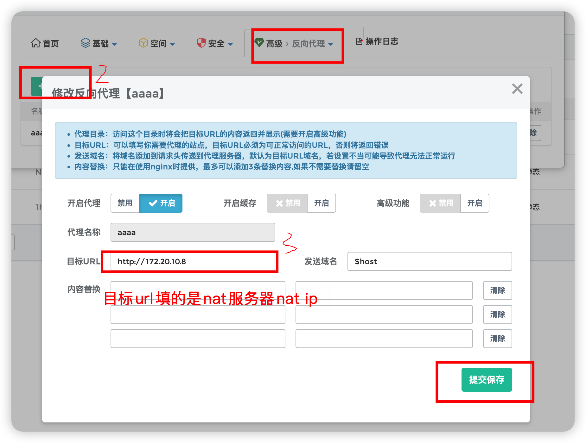
# 通过访问自己的域名
> 访问 http://langlangy.nuox.eu.org/ 后自动跳转到安装页面
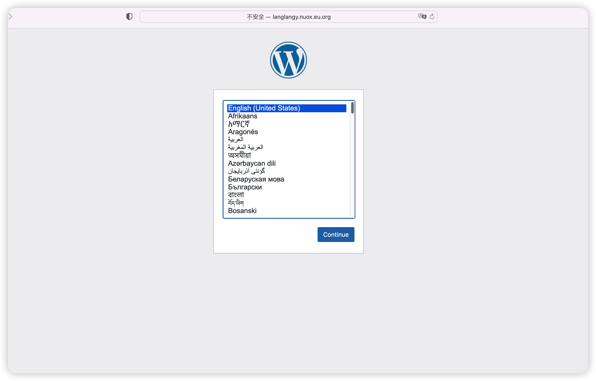
> 安装成功后进入后台

# 总结

1. 虚拟主机购买的规格是nat建站专用的就可以
 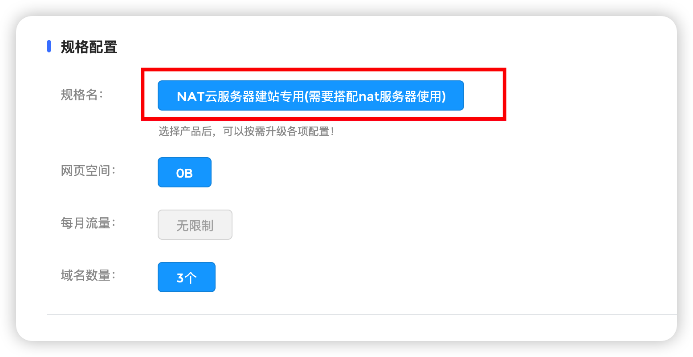
2. nat服务器建站的时候需要绑定2个域名，一个是nat服务器ip，另一个是自己的域名
3. 虚拟主机反向代理时，填写的目标url为你的nat服务器ip
4. 本次演示采用的是香港虚拟主机
