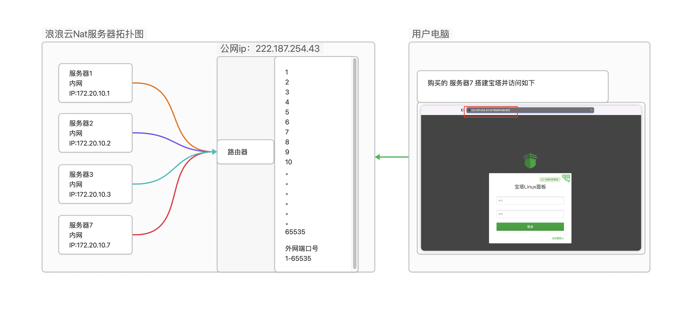
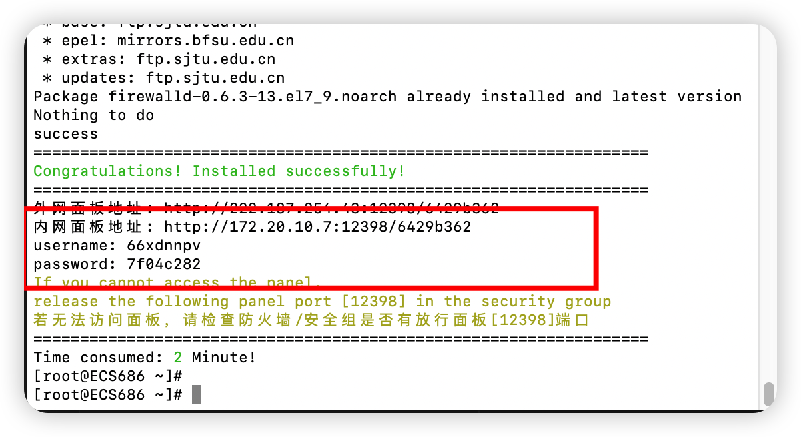
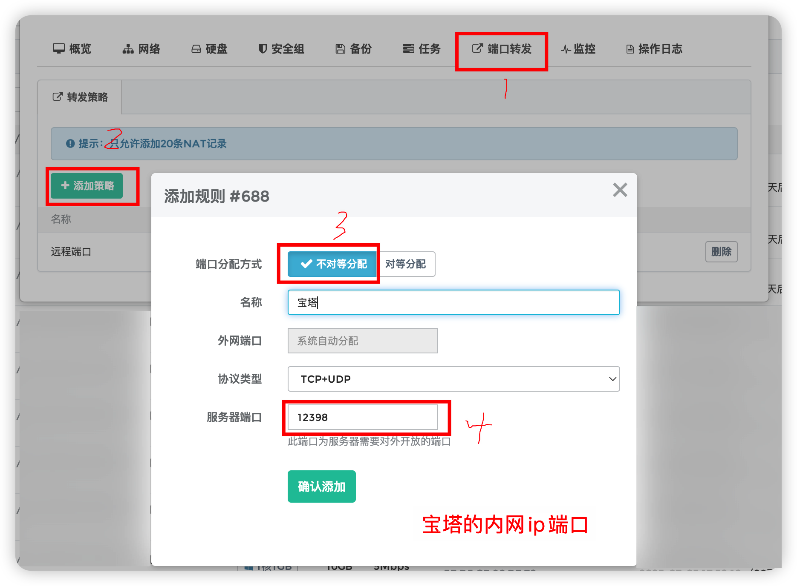
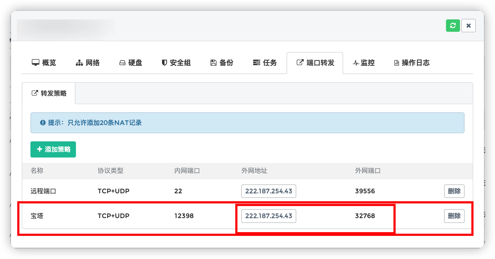
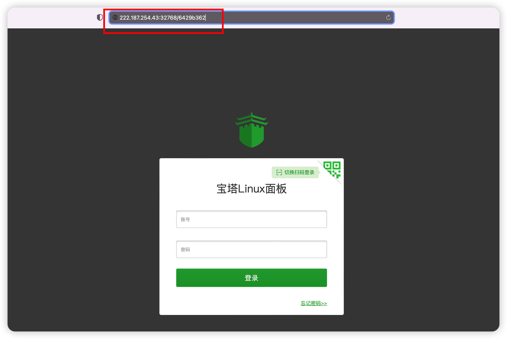

# 什么是端口号

端口号是计算机网络中用于区分不同应用程序或网络服务的标识符。它是一个16位的数字，范围从0到65535。其中，0到1023之间的端口号被称为“系统端口”或“Well-Known Ports”，通常被一些知名的服务占用，例如HTTP服务通常使用80端口，而HTTPS服务通常使用443端口。除了预留的系统端口，其余的端口号可以由用户或应用程序自行指定使用。在网络通信中，数据包会通过源地址、目标地址和端口号来实现传输和接收。

# 什么是NAT
NAT英文全称是"Network Address Translation"，中文意思是 网络地址转换，通过端口转发将内网端口转换成外网端口，实现访问服务。NAT是将私有IP地址通过边界路由转换成外网IP地址，在边界路由的NAT地址转换表记录下这个转换映射记录，当外部数据返回时，路由使用NAT技术查询NAT转换表，再将目标地址替换成内网用户IP地址。

# NAT服务器的工作原理拓扑图

> 下面以搭建宝塔为例,采用centos7.6 1h1g5m服务器搭建

# 安装宝塔完成后

给出了公网面板地址和内网面板地址：http://172.20.10.7:12398/6429b362。12398是宝塔端口
直接去访问外网面板地址是无法访问的，需要通过端口转发才能访问成功

# 添加端口转发

> 在服务器控制面板找到端口转发，不对等分配填上宝塔端口后确认

# 查看宝塔的外网端口

> 确认后会得到外网端口32768，通过外网ip+外网端口就可以实现访问了
> 宝塔需要加上安全地址6429b36才能访问 http://222.187.254.43:32768/6429b362

# 访问如下
http://222.187.254.43:32768/6429b362

